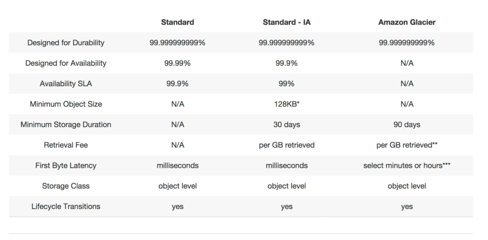

# AWS ASSOCIATED NOTES

## Glacier

- **Glacier** is an extremely low-cost storage service for data archival. Amazon Glacier stores data for as little as $0.01 per GB/month, and is optimized for data that is infrequently accessed and for which retrieval times of 3 to 5 hours are suitable.

### Main concepts

- S3 vs Glacier:

- Charged for:
  - Storage
  - Requests
  - Storage Management Pricing
  - Data Transfer Pricing
  - Transfer Acceleration (enables fast, easy and secure transfers of files over long distances between your end users and an S3 bucket. *It takes advantage of Amazon CloudFront's globally distributed edge localizations*. As the data arrives at an edge location, data is routed to S3 over an optimized network path).

### Exam notes
