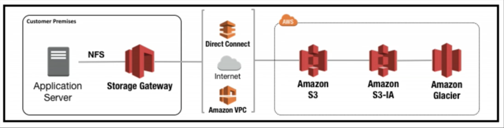
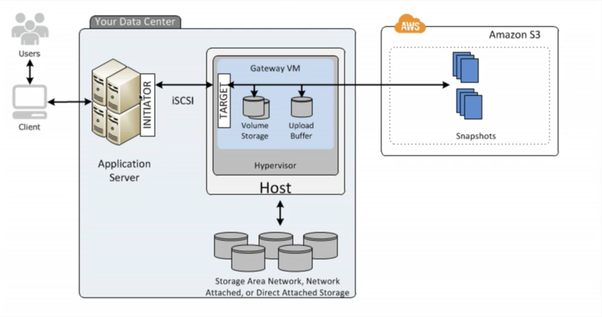
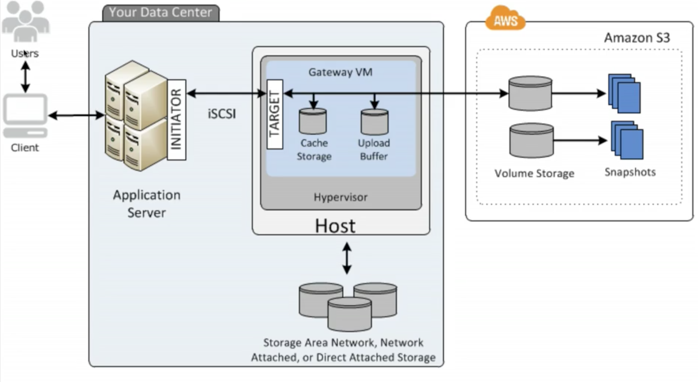
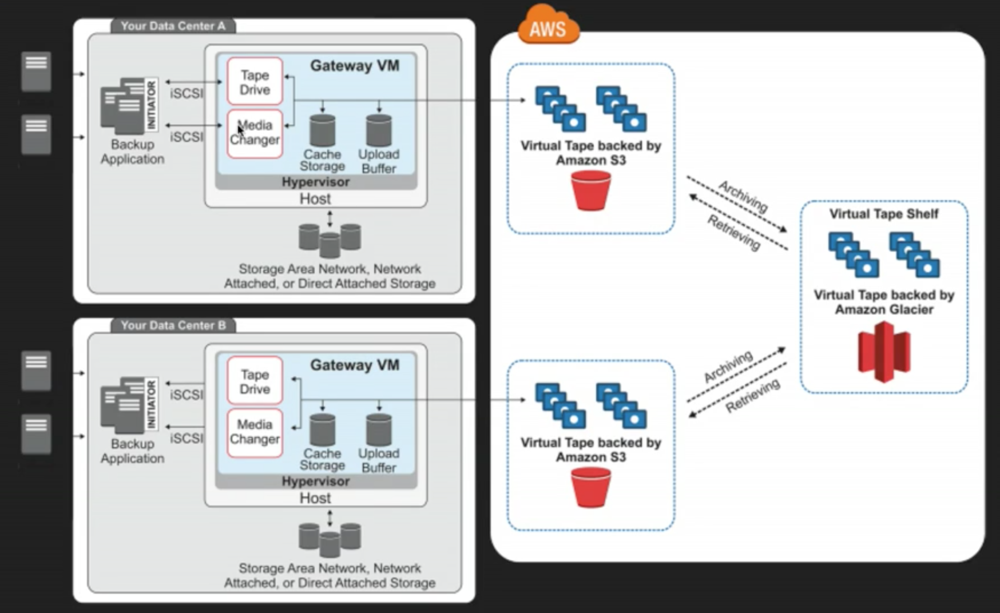

# AWS ASSOCIATED NOTES

## Storage Gateway

- **AWS Storage Gateway** is a service that connects an on-promises software appliance with cloud-based storage to provide seamless and secure integration between an organization's on-premises IT environment and AWS's storage infrastructure. The service enables you to securely store data to the AWS cloud for scalable and cost-effective storage.

### Main features

- **AWS Storage Gateway's** software appliance is available for download as a virtual machine (VM) image that you install on a host in your datacenter. Storage Gateway supports either VMWare ESXi or Microsoft Hyper-V. Once you've installed your gateway and associated it with your AWS account through the activation process, you can use the AWS Management Console to create the storage gateway option that is right for you.

- **Storage Gateways Types**:
  - **_File Gateway (NFS)_** : Files are stored as objects in S3 buckets, accessed through a Network File System (NFS) mount point. Ownership, permissions, and timestamps are durably stored in S3 in the user-metadata of the object associated with the file. One objects are transferred to S3, they can be managed as native S3 objects, and bucket policies such as versioning, lifecycle management, and cross-region replication apply directly to objects stores on S3.

  

  - **_Volumes Gateway (iSCSI)_**: The volume interface presents your applications with disk volumes using the iSCSI block protocol. Data written to these volumes can be asynchronously backed up as point-in-time snapshots of your volumes, and stored in the cloud as Amazon EBS snapshots. Snapshots are incremental backups that capture only changed blocks. All snapshot storage is also compressed to minimize your storage charges.

    - **Stored Volumes** (Entire Dataset is stored on S3 and the most frequently accessed data is cached on site): let you store your primary data locally, while asynchronously backing up that data to AWS. Stored volumes provide your on-promises applications with low-latency access to their entire datasets, while providing durable, off-site backups. You can create storage volumes and mount them as iSCSI devices from your on-premises application servers. Data written to your stored volumes is stored on your on-premises storage hardware. This data is asynchronously backed up to S3 in the form of EBS snapshots. 1GB - 16 TB in size for Stored Volumes.

    

    - **Cached Volumes** (Entire Dataset is stored on site and is asynchronously backed up to S3): let you use S3 as your primary data storage while retaining frequently accessed data locally in your storage gateway. Cached volumes minimize the need to scale your on-premises storage infrastructure, while still providing your applications with low-latency access to their frequently accessed data. You can create storage volumes up to 32 TiB in size and attach to them as iSCSI devices from your on-premises application servers. Your gateway stores data that you write to these volumes in S3 and retains recently read data in your on-premises storage gateway's cache and upload buffer storage. 1GB - 32 TB in size for Cached Volumes.

    

  - **_Tape Gateway (VTL)_** (Used for backup and uses popular backup applications like NetBackup, Backup Exec, Veeam etc): offers a durable, cost-effective solution to archive your data in the AWS Cloud. The VTL interface it provides lets you leverage your existing tape-based backup application infrastructure to store data on virtual tape cartridges that you create on your tape gateway. Each tape gateway is preconfigured with a media changer and tape drives, which are available to your existing client backup applications as iSCSI devices. You add tape cartridges as you need to archive your data. Supported by NetBackup, Backup Exec, Veeam etc

  

### Exam notes

- **File Gateway** for flat files, stored directly on S3
- **Volume Gateway**:
  - **Stored Volumes**: Entire Dataset is stored on site and is asynchronously backed up to S3.
  - **Changed Volumes**: Entire Dataset is stored on S3 and the most frequently accessed data is cached on site.
- **Gateway Virtual Tape Library (VTL)**: Used for backup, and uses popular backup applications like NetBackup, Backup Exec, Veeam etc.
